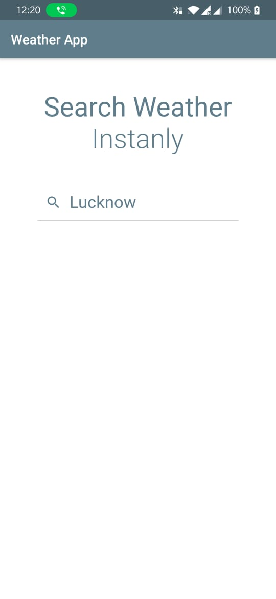
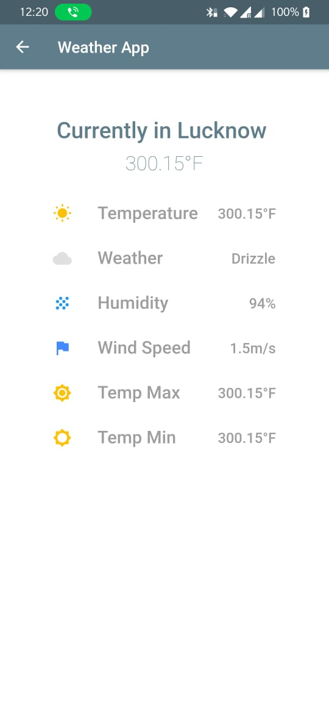
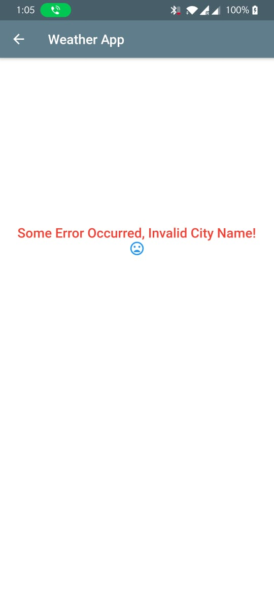

##Simple

Weather App

##Ios and Android Flutter Project

The objective of this app is to provide Weather data for the cities.

Some features of this app are:

1.Users can enter the city name from all around the world.
2.Weather data is displayed-Temperature,Weather,Humidity,
Wind Speed,Temp_Max,Temp_Min.

Technologies Used:
1.Dart
2.Flutter
3.Git and Github
4.Rest API

Packages Used:
1.https://openweathermap.org/current

Following Screenshots of the app:

